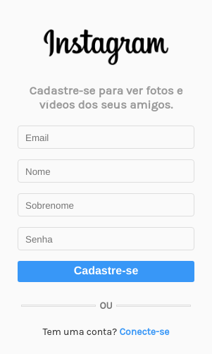
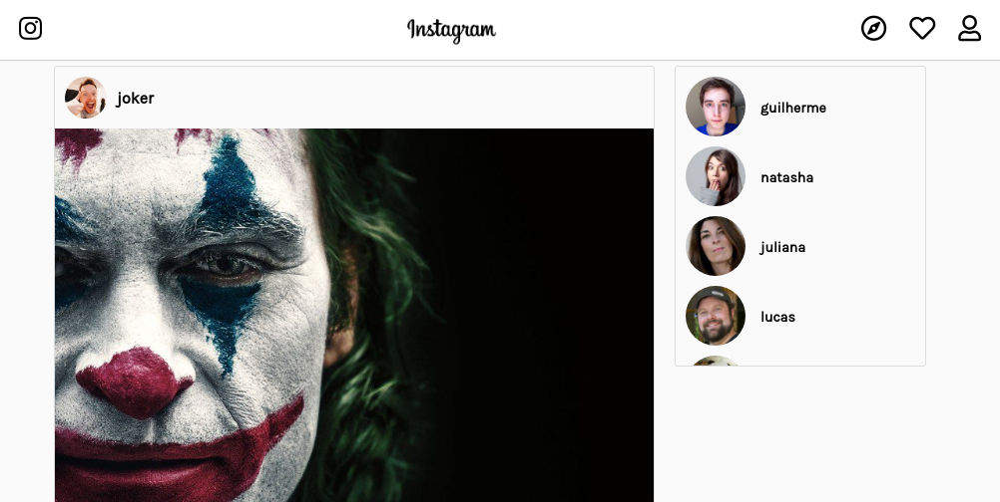

# Instagram VueJS
Instagram clone client side

## Preview

 


## Backend API
https://github.com/marceloivanofre/instragram-nodejs

## Install and run

* Project setup
```
npm install
```

* Compiles and hot-reloads for development
```
npm run serve
```

* Compiles and minifies for production
```
npm run build
```

* Run your tests
```
npm run test
```

* Lints and fixes files
```
npm run lint
```
